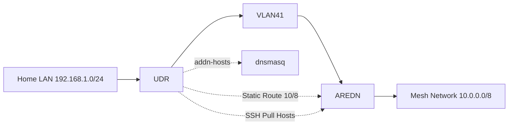

# 📡 AREDN Mesh DNS Integration with UniFi UDR-7 (Topology & Persistence)

_Last updated: Jan 2026_

This document is a **complete reference** for integrating an **AREDN
mesh node** with a **UniFi Dream Router (UDR-7)**, including:

- Physical and logical **network topology**
- Rationale behind the topology design
- Routing, NAT, and firewall behavior
- DNS mirroring strategy (not forwarding)
- Persistence across reboot using **systemd**
- What is logged and why

This reflects the **final, stable configuration** in use.

---

## 🧭 Topology Overview

### Physical / Logical Layout

    [ ISP Modem ]
          |
          |  (Public IP)
          v
    [ UniFi UDR-7 ]
          |
          |-- VLAN 40 (aredn-wan) 172.21.40.0/29
          |      |
          |      +--> AREDN Node WAN
          |
          |-- VLAN 41 (aredn-lan) 10.6.229.8/29
                 |
                 +--> AREDN Node LAN (10.6.229.9)
                        |
                        +--> AREDN Mesh (10.0.0.0/8)

# 2. High-Level Architecture



### Why This Topology

This topology is **intentional** and solves multiple constraints:

1.  **AREDN expects to be a router**, not a client
2.  UniFi WAN port must remain ISP-facing
3.  AREDN WAN must receive RFC1918 space
4.  AREDN LAN must remain authoritative for mesh routing
5.  Home LANs must:
    - reach mesh services
    - NOT be reachable from the mesh

By using **two VLANs**: - VLAN 40 provides a controlled WAN-facing
segment to AREDN - VLAN 41 provides a clean, routed LAN segment for mesh
access

This avoids: - double-NAT inside the mesh - leaking private LAN routes
into AREDN - breaking AREDN's OLSR routing assumptions

---

## 🌐 UniFi Network Configuration

### VLANs

Name VLAN Subnet Purpose

---

aredn-wan 40 172.21.40.0/29 AREDN WAN
aredn-lan 41 10.6.229.8/29 AREDN LAN / Mesh gateway

UDR IP on aredn-lan: **10.6.229.10**\
AREDN LAN IP: **10.6.229.9**

---

### Routing

Static route on UDR:

    Destination: 10.0.0.0/8
    Next hop:    10.6.229.9

Why: - AREDN mesh uses large dynamic address space - Static route avoids
per-subnet churn - Keeps routing simple and deterministic

---

### NAT

Source NAT rule:

- Source: Any UniFi LAN/VLAN
- Destination: `10.0.0.0/8`
- Interface: `aredn-lan`

Why: - Mesh nodes never learn home LAN routes - Prevents asymmetric
routing - Preserves mesh security boundaries

---

### Firewall

Rules implemented:

- **Personal / VPN → AREDN**: Allow
- **AREDN → Personal / VPN (return)**: Allow
- **AREDN → Internal (unsolicited)**: Blocked by default

DNS is _not_ forwarded --- only routed traffic is allowed.

---

# 3. VLAN Design

| VLAN | Purpose   | Subnet         |
| ---- | --------- | -------------- |
| 40   | AREDN WAN | 172.21.40.0/29 |
| 41   | AREDN LAN | 10.6.229.8/29  |

AREDN LAN IP: `10.6.229.9`  
UDR VLAN 41 IP: `10.6.229.10`

---

# 4. Static Routing Strategy

Route all mesh traffic via:

```
Destination: 10.0.0.0/8
Next Hop: 10.6.229.9
```

Rationale:

- Future-proof against dynamic subnet allocation
- No route churn
- No OLSR parsing required
- Deterministic routing behavior

---

# 5. Source NAT Boundary

Outbound NAT rule:

- Source: LAN networks
- Destination: 10.0.0.0/8
- Out Interface: VLAN 41

Purpose:

- Prevents home LAN routes from leaking into mesh
- Avoids asymmetric return traffic
- Enforces clean L3 boundary

---

## 🔑 SSH Access to AREDN

- Port: **2222**
- Authentication: **Key-based only**
- Key stored on UDR:

### Generate the SSH Key (on the UDR)

Generate a dedicated keypair for this integration so it can be rotated
independently of any admin keys.

```bash
mkdir -p /data/aredn
ssh-keygen -t ed25519 -a 64 -f /data/aredn/id_ed25519 -C "udr-aredn-dns"
```

Notes:

- The `-a 64` option strengthens key derivation for the private key.
- This key is **read-only** in practice because the AREDN user will be
  restricted (see upload section below).

### Upload the Public Key via AREDN UI

1. Log into the AREDN node UI.
2. Navigate to **Administration → SSH Keys** (may appear as **Services → SSH**
   in some firmware builds).
3. Click **Add** or **Upload** key.
4. Paste the contents of the public key file:

   `/data/aredn/id_ed25519.pub`

5. Save and apply.

Verification (from UDR):

```bash
ssh -p 2222 -i /data/aredn/id_ed25519 -o BatchMode=yes root@10.6.229.9 "uname -a"
```

If this works, the key is correctly installed.

```{=html}
<!-- -->
```

    /data/aredn/id_ed25519

This key is used exclusively for **read-only DNS data extraction**.

---

## 🧠 DNS Strategy

### Problem

- AREDN generates dynamic host files:

      /var/run/arednlink/hosts/*

- UniFi dnsmasq cannot read these directly

- DNS forwarding breaks AREDN locality assumptions

- Parent hostnames do not auto-resolve

### Solution

- Periodically **pull host data via SSH**
- Mirror into UniFi dnsmasq using `addn-hosts`
- Synthesize base hostnames

Example input (AREDN):

    10.6.229.9 lan.AL0Y-home.local.mesh

Generated output (UDR):

    10.6.229.9 lan.AL0Y-home.local.mesh
    10.6.229.9 AL0Y-home.local.mesh

No queries are forwarded into the mesh.

### Why Mirror Instead of Forward

Mirroring ensures:

- **Locality is preserved** (mesh clients still resolve mesh-only names)
- **No dependency on mesh reachability** for home LAN DNS
- **No query leakage** into the mesh from non-mesh networks

Forwarding, by contrast, introduces failure modes where DNS resolution depends
on mesh connectivity and can expose internal resolver behavior to the mesh.

---

## 📄 DNS Update Script

**File:** `/data/aredn/update-mesh-dns.sh`

```sh
#!/bin/sh
set -eu

AREDN_IP="10.6.229.9"
AREDN_PORT="2222"
SSH_KEY="/data/aredn/id_ed25519"

# Where we publish the mirrored mesh DNS
OUT_HOSTS="/run/aredn-mesh.hosts"
OUT_CONF="/run/dnsmasq.dhcp.conf.d/99-aredn-mesh.conf"

TMP_HOSTS="/tmp/aredn-mesh.hosts.$$"
TMP_CONF="/tmp/99-aredn-mesh.conf.$$"

cleanup() {
  rm -f "$TMP_HOSTS" "$TMP_CONF" 2>/dev/null || true
}
trap cleanup EXIT INT TERM

# Fetch all mesh hosts from AREDN
MESH_DATA="$(ssh \
  -p "$AREDN_PORT" \
  -i "$SSH_KEY" \
  -o BatchMode=yes \
  -o ConnectTimeout=3 \
  -o StrictHostKeyChecking=no \
  root@"$AREDN_IP" \
  'cat /var/run/arednlink/hosts/* 2>/dev/null' || true)"

# If fetch failed, do not clobber existing config
[ -n "$MESH_DATA" ] || exit 0

# Normalize, dedupe, and add base hostname aliases
echo "$MESH_DATA" \
  | tr '\t' ' ' \
  | sed 's/  */ /g' \
  | awk '
NF>=2 && $2 ~ /\.local\.mesh$/ {
  ip=$1
  name=$2
  print ip " " name

  # If hostname is lan.<node>.local.mesh, also add <node>.local.mesh
  if (name ~ /^lan\./) {
    base=name
    sub(/^lan\./, "", base)
    print ip " " base
  }
}' \
  | sort -u > "$TMP_HOSTS"

# If empty, don't clobber
[ -s "$TMP_HOSTS" ] || exit 0

# Ensure dnsmasq include directory exists (UniFi main dnsmasq uses this conf-dir)
mkdir -p /run/dnsmasq.dhcp.conf.d

# dnsmasq include to load our dynamic hosts
cat > "$TMP_CONF" <<EOF
# Auto-generated from AREDN mesh host list (do not edit)
addn-hosts=$OUT_HOSTS
local=/local.mesh/
EOF

changed=0

# Install hosts atomically ONLY if content changed
if [ ! -f "$OUT_HOSTS" ] || ! cmp -s "$TMP_HOSTS" "$OUT_HOSTS"; then
  mv "$TMP_HOSTS" "$OUT_HOSTS"
  changed=1
else
  rm -f "$TMP_HOSTS"
fi

# Install conf atomically ONLY if content changed
if [ ! -f "$OUT_CONF" ] || ! cmp -s "$TMP_CONF" "$OUT_CONF"; then
  mv "$TMP_CONF" "$OUT_CONF"
  changed=1
else
  rm -f "$TMP_CONF"
fi

# Hot-reload dnsmasq so the new hosts take effect (NO downtime)
# On UniFi, dnsmasq is not managed by dnsmasq.service; use the pid-file/command line instead.
if [ "$changed" -eq 1 ]; then
  # Preferred: UniFi main dnsmasq pid-file
  if [ -r /run/dnsmasq-main.pid ]; then
    DNSMASQ_PID="$(cat /run/dnsmasq-main.pid 2>/dev/null || true)"
    if [ -n "$DNSMASQ_PID" ] && kill -0 "$DNSMASQ_PID" 2>/dev/null; then
      kill -HUP "$DNSMASQ_PID"
      exit 0
    fi
  fi

  # Fallback: HUP the dnsmasq instance that includes our conf-dir
  for pid in $(pgrep -x dnsmasq 2>/dev/null || true); do
    cmd="$(tr '\0' ' ' < /proc/"$pid"/cmdline 2>/dev/null || true)"
    echo "$cmd" | grep -q -- '--conf-dir=/run/dnsmasq.dhcp.conf.d/' || continue
    kill -HUP "$pid"
    exit 0
  done
fi

exit 0
```

---

## 🔁 Persistence via systemd

Because `/run` is ephemeral, a persistent service is required.

### Why a timer (not a loop daemon)

Using a systemd timer provides:

- Clean start/stop control via `systemctl`
- Automatic scheduling and persistence across reboots
- Separation of **logic** (script) from **scheduling** (timer)

The standalone daemon script below is retained as an alternative option, but
the timer is the primary, recommended approach.

### Daemon Script

**File:** `/mnt/data/aredn/mesh-dns-daemon.sh`

```sh
#!/bin/sh
set -eu

# Wait a bit for VLAN bridges/routes to be ready
sleep 60

# Loop forever
while true; do
    if /data/aredn/update-mesh-dns.sh; then
        echo "$(date) updated" >> /mnt/data/aredn/mesh-dns.log
    else
        echo "$(date) update failed" >> /mnt/data/aredn/mesh-dns.log
    fi
    sleep 60
done
```

### systemd Unit

**File:** `/etc/systemd/system/aredn-mesh-dns.service`

```ini
[Unit]
Description=AREDN Mesh DNS Mirror (dnsmasq addn-hosts)
After=network-online.target
Wants=network-online.target

[Service]
Type=oneshot
ExecStart=/data/aredn/update-mesh-dns.sh
StandardOutput=journal
StandardError=journal
```

**File:** `/etc/systemd/system/aredn-mesh-dns.timer`

```ini
[Unit]
Description=Run AREDN Mesh DNS Mirror periodically

[Timer]
Unit=aredn-mesh-dns.service
OnCalendar=*:0/2
AccuracySec=15s
Persistent=true

[Install]
WantedBy=timers.target
```

---

## 📋 Logging

Log file:

    /mnt/data/aredn/mesh-dns.log

Contents: - Timestamp of each update attempt - Success or failure
indicator

Example:

    Sun Jan 25 20:41:00 UTC 2026 updated
    Sun Jan 25 20:42:00 UTC 2026 updated

Purpose: - Verifies boot persistence - Confirms loop execution - Aids
troubleshooting without syslog

---

## ✅ Validation

```bash
nslookup AL0Y-home.local.mesh 172.21.10.1
nslookup lan.AL0Y-home.local.mesh 172.21.10.1
```

Expected:

    Address: 10.6.229.9

---

## 🧩 Key Design Principles

- **AREDN remains authoritative**
- **UniFi remains edge router**
- **No DNS forwarding**
- **No route leakage**
- **No additional hardware**
- **Reboot safe**

---

_End of document_

---

## 🔄 Full Rebuild / Recreate Checklist

Use this section if you ever want to redo the setup from scratch.

### 1) UniFi VLANs (Network Application)

Create the two VLAN-only networks:

- **aredn-wan** — VLAN **40**, subnet **172.21.40.0/29**
- **aredn-lan** — VLAN **41**, subnet **10.6.229.8/29**

Assign the UDR IP on aredn-lan to **10.6.229.10**.

### 2) Physical Wiring

- UDR LAN port(s) carry VLAN 40 and VLAN 41 to the switch (tagged).
- AREDN node WAN port connects to the VLAN 40 access/untagged port.
- AREDN node LAN port connects to the VLAN 41 access/untagged port.

### 3) AREDN Node IPs

- **WAN**: DHCP from VLAN 40
- **LAN**: Static **10.6.229.9/29** (or ensure it is assigned consistently)

### 4) UDR Static Route

Add a route:

- Destination: **10.0.0.0/8**
- Next hop: **10.6.229.9**

### 5) UDR Source NAT Rule

Create a rule (LAN/VPN → AREDN):

- Source: Any UniFi LAN/VLAN
- Destination: **10.0.0.0/8**
- Outbound Interface: **aredn-lan**

### 6) UDR Firewall Rules

- Allow **Personal/VPN → AREDN**
- Allow **AREDN → Personal/VPN (return traffic)**
- Block **AREDN → Internal (unsolicited)**

### 7) SSH Key

- Generate the key on the UDR (see SSH section above)
- Upload the public key to AREDN UI

### 8) Place Scripts

- `/data/aredn/update-mesh-dns.sh` (DNS mirror script)
- `/mnt/data/aredn/mesh-dns-daemon.sh` (optional)

### 9) Install systemd Units

Create:

- `/etc/systemd/system/aredn-mesh-dns.service`
- `/etc/systemd/system/aredn-mesh-dns.timer`

Then enable:

```bash
systemctl daemon-reload
systemctl enable --now aredn-mesh-dns.timer
```

### 10) Validate

```bash
nslookup AL0Y-home.local.mesh 172.21.10.1
nslookup lan.AL0Y-home.local.mesh 172.21.10.1
```

Expected answer: **10.6.229.9**
